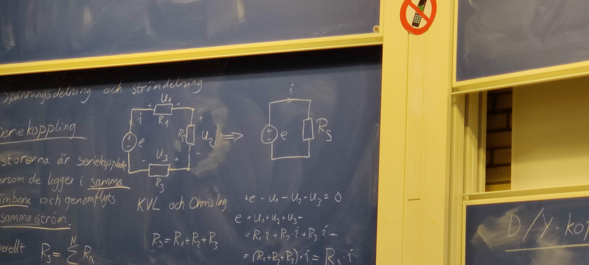
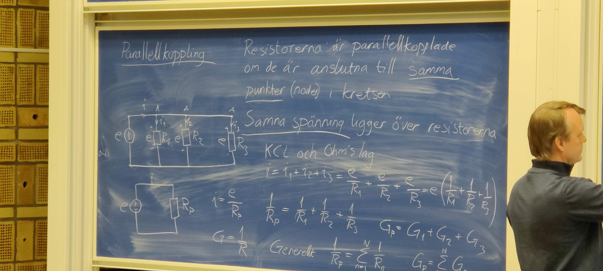
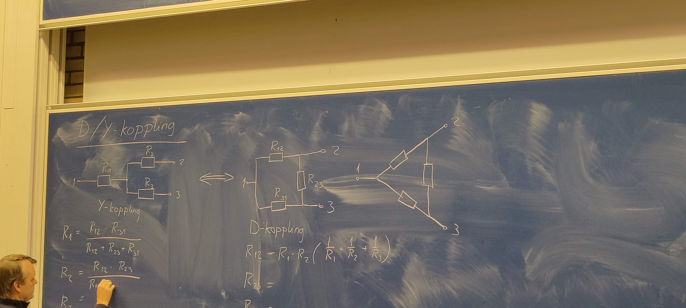
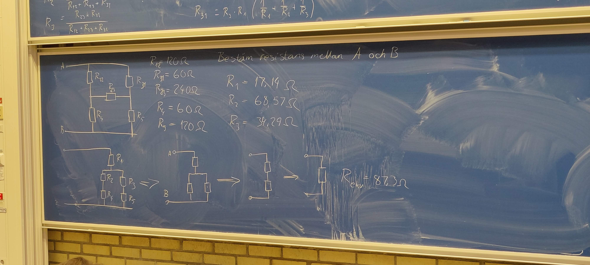
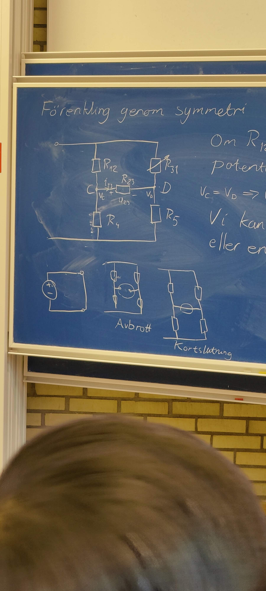
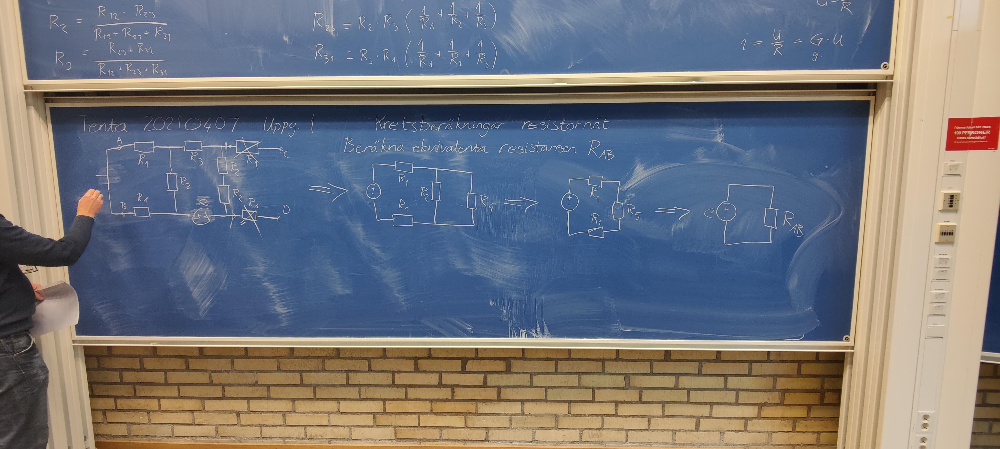

# 4/11-22 Kapitel 3

## Canvas

klassrepresentanter och lösningar på övningar finns nu på canvas

&nbsp;

## Kirchoffs lagar

### KCL (Kirchoffs Current Law)

Summan av strömmarna in i en nod är lika med summan av strömmarna ut från noden

### KVL (Kirchoffs Voltage Law)

Summan av spänningarna längs en sluten bana i en elektrisk krets är noll

&nbsp;

## Resistor kopplingarar (serie, parallel och Y/D)

### Spänningsdelning och strömdelning  

## Seriekoppling

Reistorer som sitter på en rad utan noder mellan som delar upp. Är samma sak som en resistor med summan av de andra resistorernas resistans

Resistorer är seriekopplade eftersom de ligger i **samma strömbana** och genomflyts av **samma ström**

KVL och Ohm's lag ger
$$e-u_1-u_2-u_3=0$$
$${e=u_1+u_2+u_3=R_1*i+R_2*i+R_2*i=R_s*i}$$

**Ger:**
$$R_s=R_1+R_2+R_3$$

### Generellt seriekoppling

$$R_s=\sum_{n=1}^N R_n$$

&nbsp;

## Paralellkoppling

Resistorerna är parallelkopplade om de är anslutna til **samma punkter** (noder) i kretsen. **Samma spänning** ligger över resistorerna

KCL och Ohm's lag ger

$$i=i_1+i_2+i_3={e \over R_1}+{e\over R_2}+{e\over R_3}=e({1 \over R_1}+{1\over R_2}+{1 \over R_3})$$

$G_p = G_1+G_2+G_3$

### Generellt paralellkoppling

$R_p={1 \over \sum_{n=1}^N {1 \over R_n}}$

$G_p = \sum_{n=1}^N G_n$

### Specialfall parallelkoppling

2 parallelkopplade resistorer
$$R_p={1 \over {1 \over R_1}+{1 \over R_2}}={R_1R_2 \over R_1+R_2}$$

**Skrivsätt:** $"R_1//R_2"$ är 2 parallelkopplade resistorer

### Exempel

Beräkna ekvivalenta resistansen
120//180 ger

$$R_p={120*180 \over 120+180}=72$$
$$R_r=60+R_p=60+72=132$$

&nbsp;

## D/Y koppling

Punkt 1,2,3 är samma i alla kopplingarna, spelar ingen roll hur det är kopplat. Du skall få samma svar oavsett koppling

$$R_1={R_{12}*R_{31} \over R_{12}+R_{23}+R_{31}}$$
$$R_2={R_{12}*R_{23} \over R_{12}+R_{23}+R_{31}}$$
$$R_3={R_{23}*R_{31} \over R_{12}+R_{23}+R_{31}}$$

D-koppling
$$R_{12} = R_1R_2({1\over R_1}+{1\over R_2}+{1\over R_3})$$

Sätt att få fram serie och parallel från Y/D

$$R_{12}=120Ω$$
$$R_{31}=60Ω$$
$$R_{23}=240Ω$$
$$R_4=60Ω$$
$$R_5=120Ω$$
$$R_1=17,14\Omega$$
$$R_2=68,57Ω$$
$$R_3=34,29Ω$$

**Ovan ger:** $R_r=87,3Ω$

&nbsp;

### Specialfall D/Y

Förenkling genom symetri

Om $R_{12}=R_{31}$ och $R_4=R_5$

så kommer potentialen i nod C vara samma som i nod D

$V_C=V_D=>U_{23}=0=>i_{23}=0$

Vi kan byta ut $R_{23}$ mot ett avbrott eller en kortslutning. Vilket ger samma effekt i kommande beräkningar men ritas olika.

&nbsp;

## Spänningsdelning

Kan användas för att beräkna **spänningen** över en resistor i en **seriekoppling**. Formeln nedan får användas vid tentamen utan att bevisa den

$$u_2=R_2*i=R_2*{e \over R_3}=R_2*{e \over R_1+R_2+R_3}=$$
$$={R_2 \over R_1+R_2+R_3}*e$$
$$u_1={R_1 \over R_1+R_2+R_3}*e$$
$$u_2={R_2 \over R_1+R_2+R_3}*e$$
$$u_3={R_3 \over R_1+R_2+R_3}*e$$
$$e=u_1+u_2+u_3={R_1+R_2+R_3 \over R_1+R_2+R_3}*e=e$$

Generellt:
$U_{R_M}={R_m \over \sum_{n=1}^N R_n}*e$

$U_{R_2}={R_m \over \sum_{n=1}^3 R_2}*e$

&nbsp;

## Strömdelning (strömgrening)

Kan används för att beräkna **strömmen** genom en resistor i en **parallellkopling**

$i_1={e \over R_1}={R_p*i \over R_1}={{1 \over R_1} \over {1 \over R_p}}*i={{1 \over R_1} \over {1 \over R_1}+{1 \over R_2}+{1 \over R_3}}*i$

Generellt

$i_{R_M}={{1\over R_m}\over {\sum_{n=1}^N {1\over R_n}}}*i$

$i_{R_M}={G_M\over \sum_{n=1}^N G_n}*i$

&nbsp;
&nbsp;

## Tenta 20210407

### Uppgift 1

Kretsberäkningar i resistornät

Beräkna ekvivalenta resistansen $R_{AB}$

(Inget är inkopplat på punkt C eller punkt D) gör att vi kan ta bort de sista 2 resistorerna längst till höger

$$R_4=R_3+R_3+R_2+R_2=2*R_2+2*R_3$$
$$R_5=R_2+R_4=3*R_2+2*R_3$$
$$R_{AB}=R_1+R_5+R_1=2*R_1+3*R_2+2*R_3$$
